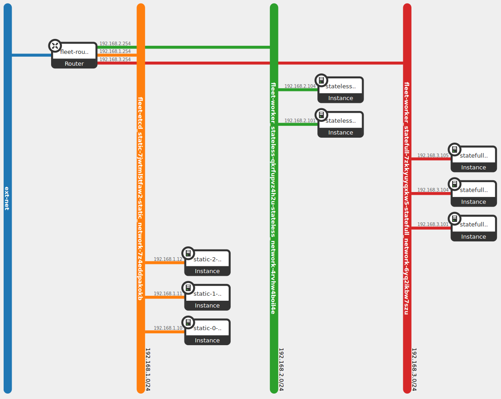
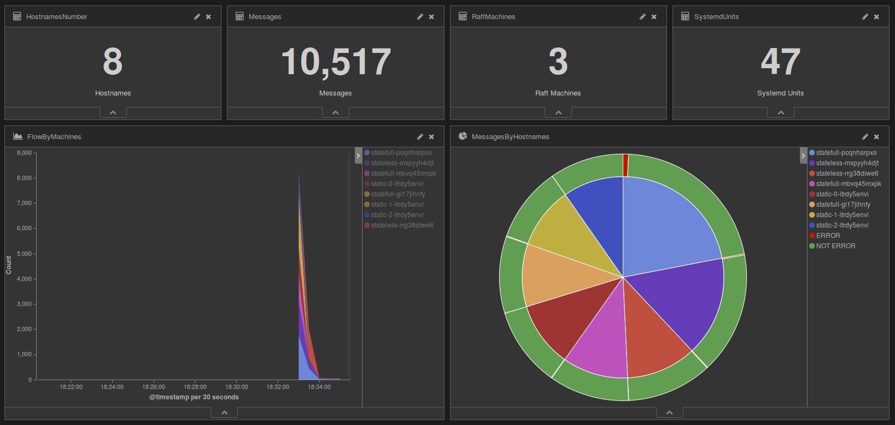

# Openstack Juno

Note: Some improvement to do with the Liberty for etcd add / remove members field.

# Stages

#### Image

First, *easily* generate an image with `make instance`, this will produced this output:

    ...
    2016-09-13 16:10:21Z [random]: CREATE_IN_PROGRESS  state changed
    2016-09-13 16:10:21Z [generate_userdata]: CREATE_IN_PROGRESS  state changed
    2016-09-13 16:10:22Z [random]: CREATE_COMPLETE  state changed
    2016-09-13 16:10:22Z [generate_userdata]: CREATE_COMPLETE  state changed
    2016-09-13 16:10:22Z [generate_securitygroup]: CREATE_IN_PROGRESS  state changed
    2016-09-13 16:10:23Z [network]: CREATE_IN_PROGRESS  state changed
    2016-09-13 16:10:24Z [generate_securitygroup]: CREATE_COMPLETE  state changed
    2016-09-13 16:10:24Z [network]: CREATE_COMPLETE  state changed
    2016-09-13 16:10:24Z [subnet]: CREATE_IN_PROGRESS  state changed
    2016-09-13 16:10:26Z [subnet]: CREATE_COMPLETE  state changed
    2016-09-13 16:10:26Z [port]: CREATE_IN_PROGRESS  state changed
    2016-09-13 16:10:26Z [router]: CREATE_IN_PROGRESS  state changed
    2016-09-13 16:10:28Z [port]: CREATE_COMPLETE  state changed
    2016-09-13 16:10:28Z [router]: CREATE_COMPLETE  state changed
    2016-09-13 16:10:28Z [interface]: CREATE_IN_PROGRESS  state changed
    2016-09-13 16:10:30Z [interface]: CREATE_COMPLETE  state changed
    2016-09-13 16:10:30Z [instance]: CREATE_IN_PROGRESS  state changed
    2016-09-13 16:10:32Z [floating]: CREATE_IN_PROGRESS  state changed
    2016-09-13 16:10:34Z [floating]: CREATE_COMPLETE  state changed
    2016-09-13 16:11:54Z [instance]: CREATE_COMPLETE  state changed
    +---------------------+------------------------------------------------------------------+
    | Field               | Value                                                            |
    +---------------------+------------------------------------------------------------------+
    | id                  | 00000000-aaaa-bbbb-cccc-999999999999                             |
    | stack_name          | instance                                                         |
    | description         | All in one to prepare image for Fleet and Kubernetes main stacks |
    |                     |                                                                  |
    | creation_time       | 2016-09-13T16:10:21Z                                             |
    | updated_time        | None                                                             |
    | stack_status        | CREATE_COMPLETE                                                  |
    | stack_status_reason | Stack CREATE completed successfully                              |
    +---------------------+------------------------------------------------------------------+

 
The instance will shutting down and write a healthy result over the console.
Ensure with `make is_instance_finished_well` and `make is_instance_off`

Then, `make image`

    Server snapshotting... 25% complete
    ...
    Server snapshotting... 100% complete
    Finished

Remove the current image with

    make iclean
    2016-09-13 16:32:39Z [instance]: DELETE_IN_PROGRESS  state changed
    2016-09-13 16:32:40Z [floating]: DELETE_IN_PROGRESS  state changed
    2016-09-13 16:32:43Z [floating]: DELETE_COMPLETE  state changed
    2016-09-13 16:32:49Z [instance]: DELETE_COMPLETE  state changed
    2016-09-13 16:32:49Z [port]: DELETE_IN_PROGRESS  state changed
    2016-09-13 16:32:49Z [generate_userdata]: DELETE_IN_PROGRESS  state changed

    
    
Once the fleet image is done, you're ready to launch a fleet cluster.

    make fleet
    
    2016-09-13 16:22:06Z [router]: CREATE_IN_PROGRESS  state changed
    2016-09-13 16:22:07Z [router]: CREATE_COMPLETE  state changed
    2016-09-13 16:22:07Z [etcd_static]: CREATE_IN_PROGRESS  state changed
    2016-09-13 16:25:03Z [etcd_static]: CREATE_COMPLETE  state changed
    2016-09-13 16:25:03Z [worker_statefull]: CREATE_IN_PROGRESS  state changed
    2016-09-13 16:28:17Z [worker_statefull]: CREATE_COMPLETE  state changed
    2016-09-13 16:28:17Z [worker_stateless]: CREATE_IN_PROGRESS  state changed
    2016-09-13 16:30:09Z [worker_stateless]: CREATE_COMPLETE  state changed
    +---------------------+------------------------------------------------------------------------------------------+
    | Field               | Value                                                                                    |
    +---------------------+------------------------------------------------------------------------------------------+
    | id                  | 00000000-aaaa-bbbb-cccc-999999999999                                                     |
    | stack_name          | fleet                                                                                    |
    | description         | Fleet cluster over etcd static cluster, with Flannel, Kafka + ELK access over Traefik RP |
    |                     |                                                                                          |
    | creation_time       | 2016-09-13T16:22:06Z                                                                     |
    | updated_time        | None                                                                                     |
    | stack_status        | CREATE_COMPLETE                                                                          |
    | stack_status_reason | Stack CREATE completed successfully                                                      |
    +---------------------+------------------------------------------------------------------------------------------+

Now, the following infrastructure is ready:

The stateless instance expose two services, Kibana and Inventory

You can import the kibana/sample.json dashboard to visualize this:

## Technologies

* ResourceGroup of 3 instances of etcd members
* AutoScalingGroup of 3 instances marked as stateful
* AutoScalingGroup of 2 instances marked as stateless

#### Etcd static

* Etcd member (as static bootstrap)
* Flannel
* Fleet
* SkyDNS
* Journald Stream to Kafka

#### Stateful

* Etcd proxy
* Flannel
* Fleet
* SkyDNS
* Journald Stream to Kafka
* Torus (inactive)
* Elasticsearch
* Zookeeper
* Kafka

#### Stateless

* Etcd proxy
* Flannel
* Fleet
* SkyDNS
* Journald Stream to Kafka
* Traefik
* Logstash
* Kibana

## Under the hood

### Etcd management

    etcdctl cluster-health
    member 1eeb69136ece2e20 is healthy: got healthy result from http://192.168.1.10:2379
    member 761d10027054fc0a is healthy: got healthy result from http://192.168.1.12:2379
    member 9e2fef28ec9ef1b0 is healthy: got healthy result from http://192.168.1.11:2379
    cluster is healthy

To add an extra etcd member in the cluster:

    make fleet_add_extra_member
    # Will produce the following stdout:
    
    subnet="00000000-aaaa-bbbb-cccc-999999999999"
    network="00000000-aaaa-bbbb-cccc-999999999999"
    key_name="ubuntu"
    image="fleet"
    etcd_initial_cluster_ip="http://192.168.1.10:2379,http://192.168.1.11:2379,http://192.168.1.12:2379"
    etcd_initial_cluster="static0=http://192.168.1.10:2380,static1=http://192.168.1.11:2380,static2=http://192.168.1.12:2380"
    prefix="192.168.1.1"
    anti_affinity="00000000-aaaa-bbbb-cccc-999999999999"
    etcd_initial_cluster_token="iTRDy5eNvi"
    security_group="00000000-aaaa-bbbb-cccc-999999999999"
    flavor="m1.medium"
    name="static"
    ...
    2016-09-13 17:02:19Z [port]: CREATE_IN_PROGRESS  state changed
    2016-09-13 17:02:20Z [userdata]: CREATE_IN_PROGRESS  state changed
    2016-09-13 17:02:21Z [userdata]: CREATE_COMPLETE  state changed
    2016-09-13 17:02:21Z [port]: CREATE_COMPLETE  state changed
    2016-09-13 17:02:21Z [instance]: CREATE_IN_PROGRESS  state changed
    2016-09-13 17:05:09Z [instance]: CREATE_COMPLETE  state changed
    +---------------------+---------------------------------------+
    | Field               | Value                                 |
    +---------------------+---------------------------------------+
    | id                  | 00000000-aaaa-bbbb-cccc-999999999999  |
    | stack_name          | etcd_static-3-iTRDy5eNvi              |
    | description         | Etcd instance for static Etcd cluster |
    |                     |                                       |
    | creation_time       | 2016-09-13T17:02:19Z                  |
    | updated_time        | None                                  |
    | stack_status        | CREATE_COMPLETE                       |
    | stack_status_reason | Stack CREATE completed successfully   |
    +---------------------+---------------------------------------+
    
    etcdctl cluster-health
    member 1eeb69136ece2e20 is healthy: got healthy result from http://192.168.1.10:2379    
    member 761d10027054fc0a is healthy: got healthy result from http://192.168.1.12:2379
    member 9e2fef28ec9ef1b0 is healthy: got healthy result from http://192.168.1.11:2379
    member 2b271486cef2a7b4 is healthy: got healthy result from http://192.168.1.13:2379
    cluster is healthy
    
And delete the latest extra member
    
    make fleet_delete_extra_member
    2016-09-13 17:06:52Z [instance]: DELETE_IN_PROGRESS  state changed
    2016-09-13 17:07:18Z [instance]: DELETE_COMPLETE  state changed
    2016-09-13 17:07:18Z [port]: DELETE_IN_PROGRESS  state changed
    
     etcdctl cluster-health
    member 1eeb69136ece2e20 is healthy: got healthy result from http://192.168.1.10:2379
    failed to check the health of member 2b271486cef2a7b4 on http://192.168.1.13:2379: Get http://192.168.1.13:2379/health: dial tcp 192.168.1.13:2379: getsockopt: no route to host
    member 2b271486cef2a7b4 is unreachable: [http://192.168.1.13:2379] are all unreachable
    member 761d10027054fc0a is healthy: got healthy result from http://192.168.1.12:2379
    member 9e2fef28ec9ef1b0 is healthy: got healthy result from http://192.168.1.11:2379
    cluster is healthy

Then, re-add one

    make fleet_add_extra_member
    ...
    
    etcdctl cluster-health
    member 1eeb69136ece2e20 is healthy: got healthy result from http://192.168.1.10:2379
    member 73d3ac441595fb2c is healthy: got healthy result from http://192.168.1.13:2379
    member 761d10027054fc0a is healthy: got healthy result from http://192.168.1.12:2379
    member 9e2fef28ec9ef1b0 is healthy: got healthy result from http://192.168.1.11:2379
    cluster is healthy

Again, delete all extra **members**

    make fleet_delete_extra_members # memberS

Periodic *etcd-gc.timer* will store any missing member in /var/lib/etcd/losts

    Sep 14 15:05:56 static-2-j9cjctlpec etcd-gc[3097]: /bin/cat: /var/lib/etcd/losts: No such file or directory
    Sep 14 15:06:02 static-2-j9cjctlpec etcd-gc[3120]: bc887d297aeffc9d
    Sep 14 15:06:02 static-2-j9cjctlpec systemd[1]: Started Purge orphan Etcd Members.
    
If a missing member stored in /var/lib/etcd/losts still missing, *etcd-gc.timer* remove it
    
    Sep 14 16:05:57 static-2-j9cjctlpec systemd[1]: Starting Purge orphan Etcd Members...
    Sep 14 16:05:57 static-2-j9cjctlpec etcd-gc[3272]: bc887d297aeffc9d
    Sep 14 16:06:03 static-2-j9cjctlpec etcd-gc[3275]: Actual losts: bc887d297aeffc9d
    Sep 14 16:06:03 static-2-j9cjctlpec etcd-gc[3275]: Checking bc887d297aeffc9d
    Sep 14 16:06:21 static-2-j9cjctlpec etcd-gc[3275]: PING 192.168.1.13 (192.168.1.13) 56(84) bytes of data.
    Sep 14 16:06:21 static-2-j9cjctlpec etcd-gc[3275]: --- 192.168.1.13 ping statistics ---
    Sep 14 16:06:21 static-2-j9cjctlpec etcd-gc[3275]: 3 packets transmitted, 0 received, 100% packet loss, time 2015ms
    Sep 14 16:06:21 static-2-j9cjctlpec etcd-gc[3275]: Member is lost: bc887d297aeffc9d
    Sep 14 16:06:22 static-2-j9cjctlpec etcd-gc[3275]: Removed member bc887d297aeffc9d from cluster
    Sep 14 16:06:26 static-2-j9cjctlpec systemd[1]: Started Purge orphan Etcd Members.

    
## Add a Kibana
    
    dig @localhost kibana.skydns.local +short
    10.1.56.2
    
    systemctl start fleet-kibana@1
    dig @localhost kibana.skydns.local +short
    10.1.56.2
    10.1.47.2

    
# Setup steps

This stack is design to works behind corporate proxies and use local object store as cache

#### Python eggs
    pip install python-openstackclient
    pip install python-heatclient
    
#### Common packages
    curl jq
    
#### ACI builders
    docker2aci
    
    
#### Environment
    cp -v environment.template environment
    # FILL-IT
    # ...
    
    source environment
    make check
    
#### Versions
    cat image/versions
    
All versions listed above have to be stored in public dedicated Swift Buckets (aka containers) 

    swift list 
    # Will produce this stdout:
    
    calico
    cni
    confd
    docker
    etcd
    flannel
    fleet
    inventory
    kubernetes
    netenv
    rkt
    torus

### ACI

All ACIs have to be stored like this:
    
    swift list aci 
    # Will produce this stdout:
    
    calico-node.aci
    elasticsearch.aci
    etcd.aci
    hyperkube.aci
    jds_kafka.aci
    kafka.aci
    kibana.aci
    logstash.aci
    skydns.aci
    stage1-coreos.aci
    traefik.aci
    zookeeper.aci

### Checks

Be sure by running: 

    make check_versions